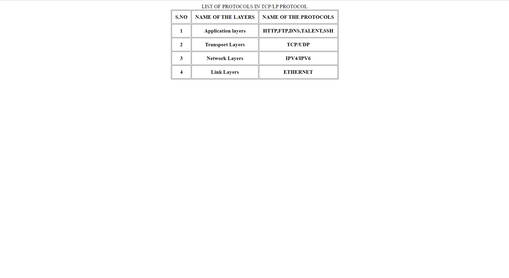

# EX01 Developing a Simple Webserver
## Date:

## AIM:
To develop a simple webserver to serve html pages and display the list of protocols in TCP/IP Protocol Suite.

## DESIGN STEPS:
### Step 1: 
HTML content creation.

### Step 2:
Design of webserver workflow.

### Step 3:
Implementation using Python code.

### Step 4:
Import the necessary modules.

### Step 5:
Define a custom request handler.

### Step 6:
Start an HTTP server on a specific port.

### Step 7:
Run the Python script to serve web pages.

### Step 8:
Serve the HTML pages.

### Step 9:
Start the server script and check for errors.

### Step 10:
Open a browser and navigate to http://127.0.0.1:8000 (or the assigned port).

## PROGRAM:
```
<!DOCTYPE html>
<html lang="en">
<head>
    <meta charset="UTF-8">
    <meta name="viewport" content="width=device-width, initial-scale=1.0">
    <title>Webserver</title>
    <style>
        * {
            margin: 0;
            padding: 0;
            box-sizing: border-box;
            font-family: -apple-system, BlinkMacSystemFont, "Segoe UI", Roboto, Helvetica, Arial, sans-serif;
        }

        body {
            background: #f4f4f4;
            text-align: center;
            padding: 20px;
        }

        header {
            font-size: 32px;
            font-weight: bold;
            margin-bottom: 20px;
            color: #007aff;
        }

        table {
            width: 50%;
            margin: 20px auto;
            border-collapse: collapse;
            background: rgba(255, 255, 255, 0.8);
            box-shadow: 0px 5px 15px rgba(0, 0, 0, 0.1);
            border-radius: 12px;
            overflow: hidden;
            backdrop-filter: blur(10px);
        }

        th, td {
            border: 1px solid rgba(0, 0, 0, 0.2);
            padding: 15px;
            text-align: left;
        }

        th {
            background: rgba(0, 122, 255, 0.8);
            color: white;
        }

        .multiplication-table {
            margin-top: 20px;
            font-size: 20px;
            color: #333;
            background: rgba(255, 255, 255, 0.9);
            padding: 15px;
            width: 40%;
            margin-left: auto;
            margin-right: auto;
            border-radius: 12px;
            box-shadow: 0px 5px 10px rgba(0, 0, 0, 0.1);
            backdrop-filter: blur(10px);
        }
    </style>
</head>
<body>
    <header>Webserver</header>
    
    <table>
        <tr>
            <th>First Name</th>
            <th>Last Name</th>
            <th>Age</th>
            <th>Reference Number</th>
        </tr>
        <tr>
            <td>RAGA</td>
            <td>SUSANTH</td>
            <td>18</td>
            <td>24001771</td>
        </tr>
        <tr>
            <td>KHAJA</td>
            <td>RASOOL</td>
            <td>18</td>
            <td>24001468</td>
        </tr>
    </table>
</body>
</html>
```
## OUTPUT:



## RESULT:
The program for implementing simple webserver is executed successfully.